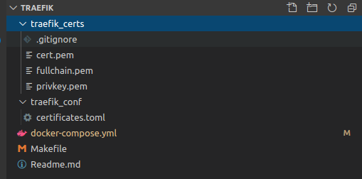
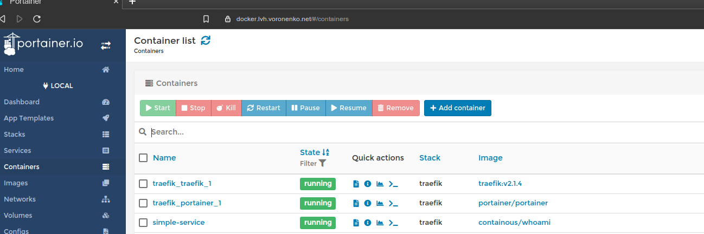

# Unobtrusive local development with traefik2, docker and letsencrypt

When it comes to developing sites that use subdomains, this can be a challenging or boring task to set up in development because localhost isn’t a fully qualified domain name. You can’t just goto example.localhost. You either constantly edit /etc/hosts or setting up
some dnsmasq in your local network.

So far most often used solutions were http://lvh.me is a free service that resolves itself along with all subdomains to localhost,
and similar to it service nip.io which allows to code ip address to resolve into domain name 192-168-1-250.nip.io, and thus allowing to
generate letsencrypt certificate to mentioned domain.

This played good for a decade, but as more and more of mine clients were moving to pull request reviews and choosing docker or
kubernetes in parallel, I found myself more and more limited with classic solutions above.

What I wanted last year - is reproducible scenario to implement own, branded local development environment that I can easily reproduce
on a remote server to implement pull request reviews scenarios, supporting some reasonable perks like green seal certificates, some troubleshouting capabilities and so on.

Let's take a look on a approach I am using now for clients using dockerized applications (either local or swarm)

## Choosing components for the solution

Cooking components:

a) docker - classic or in swarm mode. (On my work notebook I have docker in swarm mode, it does not stop it from be used as a standalone docker environment too)

b) traefik2 , and it's official docker image. Traefik is an open-source Edge Router that makes publishing your services a fun and easy experience. It receives requests on behalf of your system and finds out which components are responsible for handling them. Kind of interest for me are two backends - docker and kubernetes.

c) Development subdomain. For nicely working solution we need to dedicate some subdomain for development, for example: `*.lvh.voronenko.net` - resolving to localhost, or `*.preview.project.net` - some wildcard domain pointing to your staging server.

d) Wildard certificate from letsencrypt to organize green seal certificate. Althouth on remote box traefik might take care on obtaining green seal certificate for each exposed fqdn for you,- if you have possibility to pre-generate wildcard certificate - why not?
For domain resolving to localhost, like mentioned `*.lvh.voronenko.net` - you need to take care of certificate on your own.

For generating letsencrypt certificates my current tool of choice - is acme.sh - shell zero dependency tool. It supports number of dns providers, and generating wildcard certifate might be as simple as running short shell command. 

```sh

acme.sh --issue --dns dns_gd -d lvh.voronenko.net -d "*.lvh.voronenko.net"
```

Note that tool also takes care on prolonging certificate when necessary.
Installing certificates into necessary folder also is as simple as executing shell script

```sh
~/.acme.sh/acme.sh --install-cert -d "${DOMAIN_NAME}" \
        --cert-file $TARGET/cert.pem \
        --key-file  $TARGET/privkey.pem \
        --fullchain-file $TARGET/fullchain.pem
```

In worse case scenario (if you haven't instructed acme.sh with a command what to do on certificate prolongation) - you would need tp tale care on copying new set of certs once in 93 days.

e) Some tool you can inspect what happens with docker. There are many good console tools, but if you like one with web ui - portainer is definitely one of the best.

Now, when we have discussed components, let's combine them together:

## Local setup - instance wide traefik setup for local development



We need:

`traefik_certs` folder, where we would store pre-generated wildcard certificate (you might have more than one) also here traefik will store information about own certificates.

`traefik_conf` folder, where we would store parts of the traefik configuration we want to exclude from docker-compose.

By default, `certificates.toml` tells traefik that we have one pregenerated certificate, which can be found under specified path in certs folder.

```toml
[[tls.certificates]] #first certificate
   certFile = "/certs/fullchain.pem"
   keyFile = "/certs/privkey.pem"

#[[tls.certificates]] #second certificate
#   certFile = "/path/to/other.cert"
#   keyFile = "/path/to/other.key"
```

Controlling `Makefile` which helps you to create shared public network for docker to be used by traefik to look for exposed services, and up/down routines

```makefile

create-traefik-network-once:
        docker network create traefik-public
up:
        docker-compose up -d
down:
        docker-compose down
```

and heart of the construction: main traefik docker-compose file, in order to make story shorter I will comment most important parts of the configuration

```yaml

version: '3.4'
services:
  traefik:
    image: traefik:v2.1.4
# on my notebook traefik serves on default http https ports
# this allows natural urls like https://app.lvh.voronenko.net/
    ports:
      - 80:80
      - 443:443
# setup can be easily transformed into swarm deploy
    deploy:
      replicas: 1
      placement:
        constraints:
          - node.role == manager
        preferences:
          - spread: node.id
      labels: []
# /certs and /conf are dedicated known directories in
# official traefik image.
# in order to allow traefik to expose docker backend we are
# mapping docker socket inside.
    volumes:
      - /var/run/docker.sock:/var/run/docker.sock:ro
      - ./traefik_certs:/certs
      - ./traefik_conf:/conf
    restart: always
# if traefik supposed to serve real swarm cluster, peram should be specified
#       --docker.swarmmode
    command:
      - "--api.insecure=true"
      - "--providers.docker=true"
      - "--providers.docker.watch=true"
      - "--providers.docker.exposedbydefault=false"
      - "--providers.file.directory=/conf/"
      - "--providers.file.watch=true"
      - "--entrypoints.web.address=:80"
      - "--entrypoints.websecure.address=:443"
      - "--entrypoints.mongo.address=:27017"
      - "--entrypoints.postgres.address=:5432"
      - "--log.level=DEBUG"
      - "--accessLog"
      - "--api"
      - "--metrics"
      - "--metrics.prometheus"
      - "--providers.docker.network=traefik-public"
    networks:
      - default
      - traefik-public
# traefik configuration via labels
# expose traefik dashboard under address https://traefik.lvh.voronenko.net
    labels:
      - "traefik.enable=true"
      - "traefik.http.routers.traefik.rule=Host(`traefik.lvh.voronenko.net`)"
      - "traefik.http.routers.traefik.entrypoints=websecure"
      - "traefik.http.routers.traefik.tls.certresolver=letsencryptresolver"
      - "traefik.http.routers.traefik.service=api@internal"
      - "traefik.http.routers.traefik.tls=true"
# docker management UI to be exposed under
# https://docker.lvh.voronenko.net
  portainer:
    image: portainer/portainer
    restart: always
    volumes:
      - /var/run/docker.sock:/var/run/docker.sock
      - portainer_data:/data
    labels:
      - "traefik.enable=true"
      - "traefik.http.routers.portainer.rule=Host(`docker.lvh.voronenko.net`)"
      - "traefik.http.routers.portainer.entrypoints=web"
      - "traefik.http.routers.portainer-secure.rule=Host(`docker.lvh.voronenko.net`)"
      - "traefik.http.routers.portainer-secure.entrypoints=websecure"
      - "traefik.http.routers.portainer-secure.tls=true"
volumes:
  portainer_data:
networks:
  traefik-public:
    external: true
```

On a that moment, if you start the setup, i.e. `docker-compose up -d`, you already will get:

a) traefikUI at https://traefik.lvh.voronenko.net/ - not to much to change, but a nice bird eye view
on currently detected services. Note, that page is served on a nice grean seal certificate you configured.


b) PortainerUI at https://docker.lvh.voronenko.net/
 which provides detailed insides
in docker running on your machine, containers, services and et cetera.


Note that traefik docker-compose is fully independent component of your system without direct relation to any project you are currently worked on. This means that it can be constantly running on your host, like any other webserver.

At a moment when you need to expose some docker project you are currently working on to a traefik, you would need

a) add service exposed outside to the `traefik-public` network.

b) specify discovery rules, like fqdn for the service - "Host(`whoami.lvh.voronenko.net`)"

c) provide hints to traefik for any additional configuration,
like redirections, authorization/password protection etc.

Once you launch such docker-compose in your project folder, it will immediately get exposed with traefik. Moreover - all your teammates working on project have exactly same experience, but on their own notebooks.


```yaml

  whoami:
    image: "containous/whoami"
    container_name: "simple-service"
    networks:
      - app
      - traefik-public
    labels:
      - "traefik.enable=true"
      - "traefik.http.routers.whoami.rule=Host(`whoami.lvh.voronenko.net`)"
      - "traefik.http.routers.whoami.entrypoints=web"
#      - "traefik.http.middlewares.traefik-auth.basicauth.users=USER:PASSWORD"
#      - "traefik.http.middlewares.traefik-https-redirect.redirectscheme.scheme=https"
#      - "traefik.http.routers.traefik.middlewares=traefik-https-redirect"
      - "traefik.http.routers.traefik-secure.entrypoints=websecure"
      - "traefik.http.routers.traefik-secure.rule=Host(`whoami.lvh.voronenko.net`)"
#      - "traefik.http.routers.traefik-secure.middlewares=traefik-auth"
      - "traefik.http.routers.traefik-secure.tls=true"
networks:
  traefik-public:
    external: true

```

Your service(s) get exposed on a dedicated names, serving on a green seal certificates - almost identical copy of your production environment.


## Installing setup on a public server

Instance wide traefik setup for remote development (branch deploys, etc) is done in a similar way, but you would need to protect better your intellectual property (saying you do not want anyone on a web to preview your branch deployes) as well as protect portainer and traefik dashboards with credentials or even fully remove them from public access.


Traefik has multiple middlewares to choose from  https://docs.traefik.io/middlewares/overview/

Most reasonable middlewares to consider would be

BasicAuth  https://docs.traefik.io/middlewares/basicauth/

DigestAuth https://docs.traefik.io/middlewares/digestauth/

IPWhiteList https://docs.traefik.io/middlewares/ipwhitelist/

RateLimit   https://docs.traefik.io/middlewares/ratelimit/

also for a public server traefik will take care on a generating grean seal certificates for you, if you haven't provided pregenerated wildcard certificate.

Also changes to the `local_server` setup would be activating letsencrypt certificates provider
We introduce new mapped letsencrypt folder to store automatically retrieved certificates.

```yaml

    volumes:
      - /var/run/docker.sock:/var/run/docker.sock:ro
      - ./traefik_certs:/certs
      - ./traefik_conf:/conf
      - ./letsencrypt:/letsencrypt
```

and we additionally activate letsencrypt acme provider in traefik

```yaml
labels:
      - "--certificatesResolvers.letsencrypt.acme.email=<LETSENCRYPT_MAIL_ADDRESS>"
      - "--certificatesResolvers.letsencrypt.acme.tlsChallenge=true"
      - "--certificatesResolvers.letsencrypt.acme.httpChallenge=true"
      - "--certificatesResolvers.letsencrypt.acme.httpChallenge.entryPoint=web"
      - "--certificatesresolvers.letsencrypt.acme.storage=/letsencrypt/acme.json"
```

Althouth I recommend at least for host serving as branch deploys preview, pregenerate wild card certificate.
It is quite useless to generate new certificate per very new branch deployed (branchname.preview.voronenko.net)

For services exposed through traefik, requiring automatic certificate from letsencrypt, you would need instruct traefik 
to use letsencrypt.

```yaml
labels:
      - traefik.http.routers.whoami.tls.certresolver=letsencrypt
```

Full example for service exposed:

```yaml

  whoami:
    image: "containous/whoami"
    container_name: "simple-service"
    labels:
      - "traefik.enable=true"
      - "traefik.http.routers.whoami.rule=Host(`whoami.preview.voronenko.net`)"
      - "traefik.http.routers.whoami.entrypoints=web"
#      - "traefik.http.routers.traefik-secure.middlewares=traefik-auth"
#      - "traefik.http.middlewares.traefik-auth.basicauth.users=USER:PASSWORD"
#      - "traefik.http.middlewares.traefik-https-redirect.redirectscheme.scheme=https"
#      - "traefik.http.routers.traefik.middlewares=traefik-https-redirect"
      - "traefik.http.routers.traefik-secure.entrypoints=websecure"
      - "traefik.http.routers.traefik-secure.rule=Host(`whoami.preview.voronenko.net`)"
      - "traefik.http.routers.traefik-secure.tls=true"
      - traefik.http.middlewares.whoami.compress=true
      - traefik.http.routers.whoami.tls.certresolver=letsencrypt
     networks:
       traefik-public
```


## Summary

With described approach you are able to provide unobtrusive local development with traefik2, docker and letsencrypt for all your teammates. Startup owners are able to enforce "branded" development environment, like `app.lvh.mystartup.domain`

You can easily able to extend approach to public server, implementing "preview server" for the same components. Traefik and docker allow you possibility also to introduce pull request previews in a reasonable time (in a day)

Mentioned in article examples can be tried at https://github.com/Voronenko/traefik2-compose-template

`local_server` is the example of the development environment on your localhost, i.e. https://someapp.lvh.voronenko.net/

`public_server` is the example of the environment environment that can be deployed to the public server.

